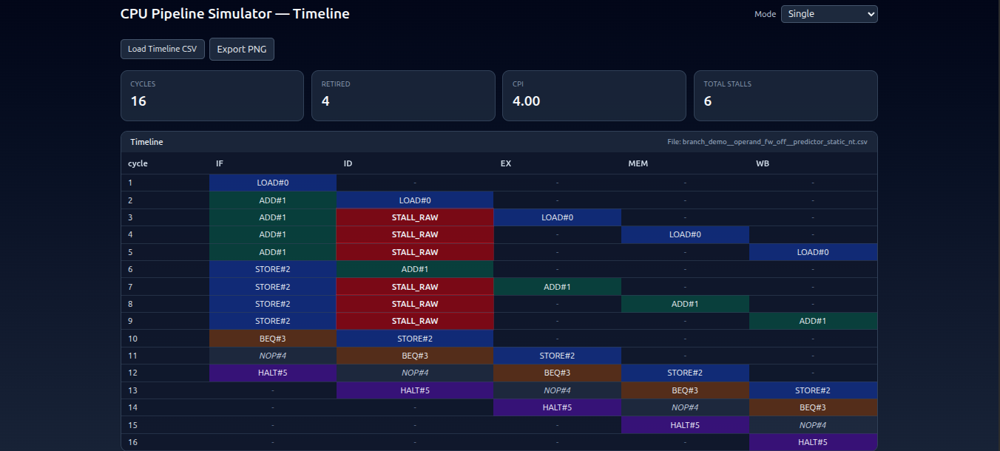
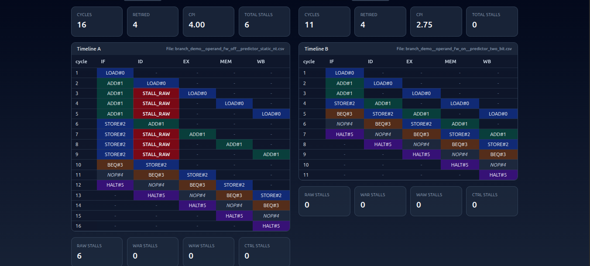

# 🚀 CPU Pipeline Simulator — Timeline Viewer

This project is a **CPU pipeline simulator** with a **React + Tailwind UI** that visualizes instruction timelines, stalls, hazards, and performance metrics from CSV traces generated by the C++ simulator.

It is designed to make it easy to **understand pipeline execution**, compare different runs (e.g., forwarding ON/OFF, predictor strategies), and analyze hazards (RAW/WAR/WAW/CTRL).

---

## 📸 Screenshots

### Single Timeline Mode


### Compare Mode (A vs B)


---

## 📂 Project Structure
```plaintext
cpu-sim/ # C++ pipeline simulator backend
├─ src/ # Source files
├─ traces/ # Example traces (branch_demo.trace, etc.)
└─ build/ # Build output (after cmake)

ui-timeline/ # React + Tailwind frontend
├─ public/ # Static assets
├─ src/ # React code (App.jsx, components)
├─ package.json # Node dependencies
└─ vite.config.js

```
## 🛠 Features
### 🔹 Timeline Grid
- Dark theme with gradient highlights:
  - **LOAD/STORE** → Blue  
  - **ALU (ADD/SUB)** → Green  
  - **Branches (BEQ/BNE)** → Amber  
  - **NOP** → Gray  
  - **HALT** → Violet  
  - **STALL** → Red
  - ### 📊 Metrics
- **Stall & Hazard metrics**  
  - Total stalls  
  - RAW, WAR, WAW, CTRL stall breakdown
      
- **Performance metrics**  
  - Total cycles  
  - Retired instructions  
  - CPI  

### 🆚 Comparison Mode
- Side-by-side timelines for comparing two traces  
- **Bar chart** comparing total stalls and CPI  

### 📤 Export & Labels
- Export timeline as **PNG snapshot** (via `html2canvas`)  
- CSV file name shown above each timeline (no guessing!)  

---

## 🚀 Tech Stack
- **React + TypeScript**  
- **TailwindCSS** (dark theme styling)  
- **Recharts** (bar chart visualization)  
- **html2canvas** (export as PNG)
- 
### Backend (C++ Simulator)
- Supports pipeline simulation with configurable:
  - Operand forwarding (ON/OFF)
  - Branch predictors:
    - Static (Not Taken / Taken)
    - One-bit predictor
    - Two-bit predictor
    - Tournament predictor
- Outputs CSV traces:
  - `cycle, IF, ID, EX, MEM, WB` per cycle
  - Includes `STALL_*` entries for hazards

Example output:
```csv
cycle,IF,ID,EX,MEM,WB
1,LOAD#0,-,-,-,-
2,ADD#1,LOAD#0,-,-,-
3,ADD#1,-,LOAD#0,-,-
4,STORE#2,ADD#1,-,LOAD#0,-
5,BEQ#3,STORE#2,ADD#1,-,LOAD#0
```
## Frontend (React UI)

**Dark-themed timeline grid with smooth color grading:**

LOAD/STORE → Blue

ALU ops (ADD/SUB) → Green

Branches (BEQ/BNE) → Amber

NOP → Gray

HALT → Violet

STALL → Red

Stall & hazard metrics:

Total stalls

RAW, WAR, WAW, CTRL stall breakdown

**Performance metrics:**

Cycles, Retired instructions, CPI

**Comparison mode:**

Side-by-side timelines

Bar chart comparing total stalls and CPI

Export PNG snapshot of timeline

CSV file name shown above each timeline (no need to guess)

## ⚡ Getting Started
**1. Build the simulator**
```bash cd cpu-sim
mkdir build && cd build
cmake ..
make -j
```

**Run an example trace:**
```bash
./bin/cpu-sim --trace ../traces/branch_demo.trace --predictor 2bit --out ../data/out.csv
```

This generates data/out.csv for the UI.

**2. Run the UI**
```bash
cd ui-timeline
npm install   # install deps
npm run dev   # start dev server
```
```bash
Open http://localhost:5173
 in your browser.
```

**3. Load Traces in UI**

Use the “Load Timeline CSV” button to open your generated CSV.

The timeline and metrics will render automatically.

Switch mode to Compare to load a second CSV.

**📊 Example Traces**

Example traces are included in the repo under:

cpu-sim/traces/

```bash
branch_demo.trace

hazard_demo.trace

mixed_ops.trace
```
You can run them with:
```bash
./bin/cpu-sim --trace ../traces/branch_demo.trace --predictor static_nt --out ../data/demo.csv
```
## 📦 Dependencies

Backend: C++17, CMake

Frontend:

React

Tailwind CSS

Vite

(Optional) html2canvas
 for PNG export
Install with:
```bash
npm install html2canvas
```
## 📈 Metrics Explained

Cycles → total number of pipeline cycles until HALT

Retired → instructions that completed WB (excluding HALT/NOP)

CPI → Cycles per Instruction = cycles / retired

Total Stalls → total bubbles introduced

**Hazards:**

RAW (Read After Write)

WAR (Write After Read)

WAW (Write After Write)

CTRL (branch mispredict / control)

**📝 License**

MIT — free to use for research, teaching, and learning.
